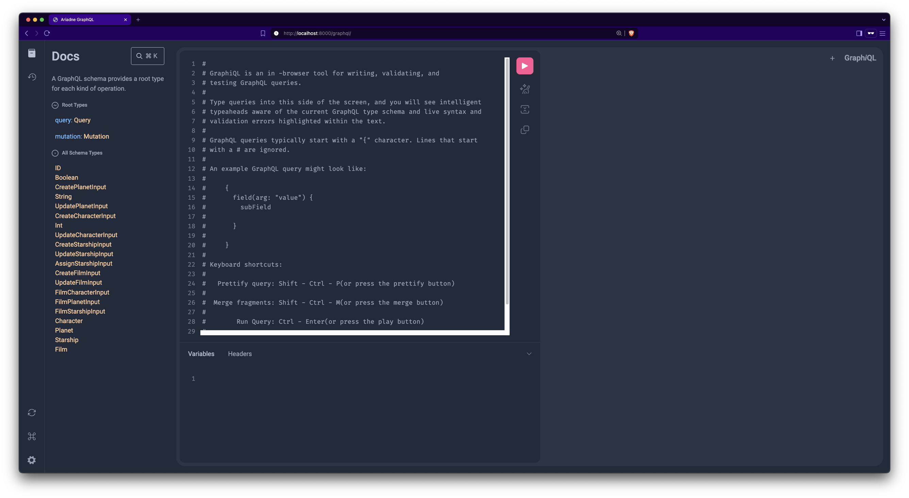
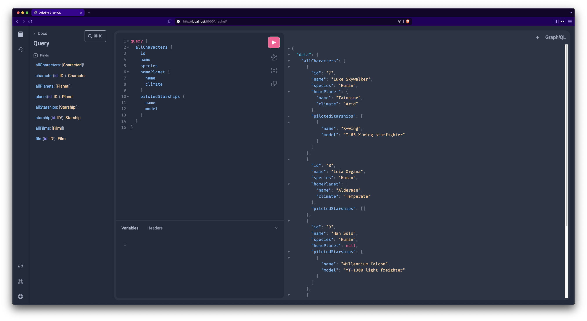
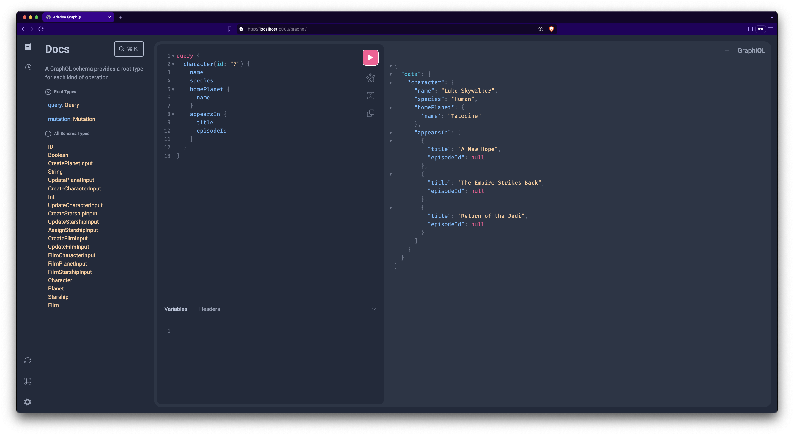
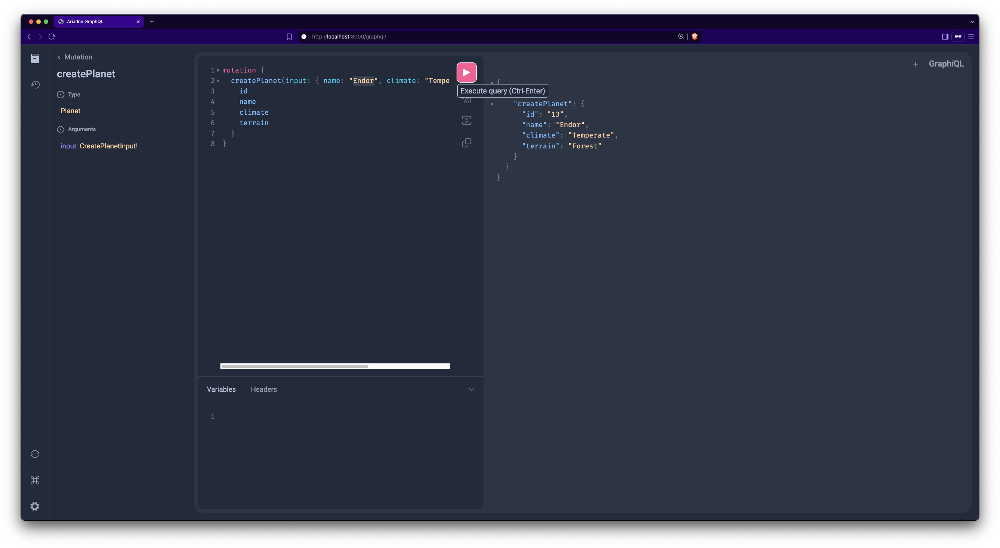

# Star Wars GraphQL API

API GraphQL berbasis FastAPI yang menyediakan data dunia Star Wars dengan operasi CRUD lengkap untuk karakter, planet, kapal luar angkasa, dan film.

Disusun oleh:

- Andri Junaedi
- Glen Davis Kusuma
- M Hanif AR

Repositiry: https://github.com/andrijunaedi/starwars-graphql-api

## 🚀 Fitur

- **GraphQL API** dengan schema yang lengkap dan type-safe
- **CRUD Operations** untuk semua entitas (Characters, Planets, Starships, Films)
- **Relationship Management** antara entitas
- **SQLite Database** dengan struktur relational
- **GraphiQL Interface** untuk testing dan eksplorasi API
- **FastAPI Integration** dengan dokumentasi otomatis

## 📋 Struktur Data

### Entitas Utama

1. **Character** - Karakter Star Wars
2. **Planet** - Planet dalam universe Star Wars
3. **Starship** - Kapal luar angkasa
4. **Film** - Film Star Wars

### Relasi

- Character dapat memiliki home planet
- Character dapat menjadi pilot multiple starships
- Film dapat menampilkan multiple characters, planets, dan starships

## 🛠️ Instalasi dan Setup

### Prerequisites

- Python 3.8+
- pip

### 1. Clone Repository

```bash
git clone https://github.com/andrijunaedi/starwars-graphql-api.git
cd starwars-graphql-api
```

### 2. Install Dependencies

```bash
pip install fastapi ariadne sqlite3 uvicorn
```

### 3. Initialize Database

```bash
python seed.py
```

### 4. Jalankan Server

```bash
uvicorn main:app --reload --port 8000
```

API akan tersedia di:

- **GraphiQL Interface**: http://localhost:8000/graphql
- **Root Endpoint**: http://localhost:8000/

## 📚 GraphQL Schema

### Types

#### Character

```graphql
type Character {
  id: ID!
  name: String!
  species: String
  homePlanet: Planet
  pilotedStarships: [Starship!]!
  appearsIn: [Film!]!
}
```

#### Planet

```graphql
type Planet {
  id: ID!
  name: String!
  climate: String
  terrain: String
  residents: [Character!]!
  appearsIn: [Film!]!
}
```

#### Starship

```graphql
type Starship {
  id: ID!
  name: String!
  model: String
  manufacturer: String
  pilots: [Character!]!
  appearsIn: [Film!]!
}
```

#### Film

```graphql
type Film {
  id: ID!
  title: String!
  episodeId: Int
  director: String
  releaseDate: String
  openingCrawl: String
  characters: [Character!]!
  planets: [Planet!]!
  starships: [Starship!]!
}
```

## 🔍 Query Examples

### Get All Characters

```graphql
query {
  allCharacters {
    id
    name
    species
    homePlanet {
      name
      climate
    }
    pilotedStarships {
      name
      model
    }
  }
}
```

### Get Character by ID

```graphql
query {
  character(id: "1") {
    name
    species
    homePlanet {
      name
    }
    appearsIn {
      title
      episodeId
    }
  }
}
```

### Get All Planets with Residents

```graphql
query {
  allPlanets {
    id
    name
    climate
    terrain
    residents {
      name
      species
    }
  }
}
```

### Get Film with Related Data

```graphql
query {
  film(id: "1") {
    title
    director
    releaseDate
    characters {
      name
    }
    planets {
      name
    }
    starships {
      name
      model
    }
  }
}
```

## ✏️ Mutation Examples

### Create Planet

```graphql
mutation {
  createPlanet(input: { name: "Endor", climate: "Temperate", terrain: "Forest" }) {
    id
    name
    climate
    terrain
  }
}
```

### Create Character

```graphql
mutation {
  createCharacter(input: { name: "Obi-Wan Kenobi", species: "Human", homePlanetId: 1 }) {
    id
    name
    species
    homePlanet {
      name
    }
  }
}
```

### Update Character

```graphql
mutation {
  updateCharacter(input: { id: "1", name: "Luke Skywalker (Jedi)", species: "Human" }) {
    id
    name
    species
  }
}
```

### Create Starship

```graphql
mutation {
  createStarship(
    input: {
      name: "Death Star"
      model: "DS-1 Orbital Battle Station"
      manufacturer: "Imperial Navy"
    }
  ) {
    id
    name
    model
    manufacturer
  }
}
```

### Assign Starship to Character

```graphql
mutation {
  assignStarship(input: { characterId: "1", starshipId: "1" }) {
    name
    pilotedStarships {
      name
      model
    }
  }
}
```

### Create Film

```graphql
mutation {
  createFilm(
    input: {
      title: "A New Hope"
      episodeId: 4
      director: "George Lucas"
      releaseDate: "1977-05-25"
      openingCrawl: "It is a period of civil war..."
    }
  ) {
    id
    title
    episodeId
    director
  }
}
```

### Add Character to Film

```graphql
mutation {
  addCharacterToFilm(input: { filmId: "1", characterId: "1" }) {
    title
    characters {
      name
    }
  }
}
```

## 🗂️ Struktur Project

```
starwars-graphql-api/
├── main.py                 # FastAPI application entry point
├── schema.graphql          # GraphQL schema definition
├── database.py            # Database connection and initialization
├── seed.py                # Database seeding script
├── starwars.db            # SQLite database file
├── resolvers/             # GraphQL resolvers
│   ├── __init__.py
│   ├── index.py           # Main resolver configuration
│   ├── character/         # Character resolvers
│   │   ├── queries.py
│   │   ├── mutations.py
│   │   └── type_defs.py
│   ├── planet/            # Planet resolvers
│   │   ├── queries.py
│   │   ├── mutations.py
│   │   └── type_defs.py
│   ├── starship/          # Starship resolvers
│   │   ├── queries.py
│   │   ├── mutations.py
│   │   └── type_defs.py
│   └── film/              # Film resolvers
│       ├── queries.py
│       ├── mutations.py
│       └── type_defs.py
└── README.md              # Documentation
```

## 🛡️ Database Schema

### Tables

1. **planets** - Menyimpan data planet
2. **characters** - Menyimpan data karakter
3. **starships** - Menyimpan data kapal luar angkasa
4. **films** - Menyimpan data film
5. **character_starships** - Relasi many-to-many karakter dan kapal
6. **film_characters** - Relasi many-to-many film dan karakter
7. **film_planets** - Relasi many-to-many film dan planet
8. **film_starships** - Relasi many-to-many film dan kapal

### Entity Relationship Diagram (ERD)

Database ERD tersedia dalam format PlantUML di file `docs/database-erd.puml`.

**Cara menggunakan PlantUML ERD:**

1. **Online PlantUML Editor**:

   - Buka [PlantUML Online Server](http://www.plantuml.com/plantuml/uml/)
   - Copy-paste isi file `docs/database-erd.puml`
   - Generate diagram

2. **VS Code Extension**:

   - Install extension "PlantUML"
   - Buka file `docs/database-erd.puml`
   - Gunakan command palette: "PlantUML: Preview Current Diagram"

3. **Command Line**:

   ```bash
   # Install PlantUML
   brew install plantuml  # macOS
   # atau download dari https://plantuml.com/download

   # Generate PNG
   plantuml docs/database-erd.puml
   ```

**Key Relationships:**

- **One-to-Many**: Planet → Characters (home planet)
- **Many-to-Many**: Characters ↔ Starships (pilots)
- **Many-to-Many**: Films ↔ Characters, Planets, Starships

## 🔧 Input Types

### Create Operations

- `CreatePlanetInput`
- `CreateCharacterInput`
- `CreateStarshipInput`
- `CreateFilmInput`

### Update Operations

- `UpdatePlanetInput`
- `UpdateCharacterInput`
- `UpdateStarshipInput`
- `UpdateFilmInput`

### Relationship Operations

- `AssignStarshipInput`
- `FilmCharacterInput`
- `FilmPlanetInput`
- `FilmStarshipInput`

## 🧪 Testing

Gunakan GraphiQL interface di http://localhost:8000/graphql untuk:

1. **Explore Schema** - Lihat semua types, queries, dan mutations
2. **Auto-completion** - Dapatkan suggestions saat mengetik
3. **Documentation** - Akses docs untuk setiap field
4. **Query Testing** - Test queries dan mutations secara real-time

## Screenshots

### GraphiQL Interface


_Interface GraphiQL dengan schema explorer dan query editor_

### Query All Characters


_Contoh query untuk mengambil semua karakter dengan data relasi_

### Character Detail Query


_Query detail karakter dengan home planet dan starships_

### Create Planet Mutation


_Contoh mutation untuk membuat planet baru_

### Database Structure

![Database ERD](https://www.plantuml.com/plantuml/png/fLNTKlCs4BttKsnp4_3WYzvcA0D34uRoqq1WshkCi3UnYYmPMOR9aCxqMVfeVP9gaQr8VFu6lk4gadPrpjcZZVUuCKoRjXB9JwR42g4MZCkaUUIoPffL8BX4iwaHb3Qb2W8ron_P6XTc8n0qveR9jS0a6SDK6cusKE2AIswuaas2xcXaqIrSCmBMGBU6rmGWXJJbHPh21CwlxwPdqriuF9nV71tPM9PH0aXMeGtVJV-yix7xw_ER-od58HUyOgQFsGE3MjiY-eE_4q-VbrPwRkDEWTz-NKHJOywnsOaeLOLBL-AI5n7aZ203LVG4JSbh9yhllgofKWMAdQAAoNPbosqrwW5lLbnKJW6jFirkBujXUgnvOnN4rKSP1QU-KNgdKQD0rk2oY1vKrIYvN2zppLv487qClxKofmu3mnu4MkbAKvsRpAYCVWcGKSARez_smJBsdiwNjFNLxp87V3YWb-mIUw3lvhttUlck6VsPvwQJZsWzoETvm_zWSF13jExAvpbZczsHtGvmVj7XCTn6Bpw6toNstJ21kIirEu9JxtxI6GBRRPQfr_2hC85H_3yU4SDLq62J00WEBUwYhpJnE16ogtiIzY31UeC6S_lei8APDO_8ewB8KG_cUul0Q4D00mAZF1_-YDMPEaJfV8j8lTc3QMxr0Q7tU8YIpZrXx6oSDkpi9QvH5eb0-W7DrwL90BQ_m69JFIX1gojaz3M2BGLiNyulqjGkvffNJ6_W0ZS-D7EXcTB8rp8AkSyWXU5UygSMuTJshA71PReaYjtYKyir5hPw58KBz8Li-zucdsp8AXPEVYALGVgdNV-SW2KZm-0FMocSQLQNDvTmCZ-7NvbX3wn1MEGbLYnDRUvR-fKLuQOunsP2v_3VF_-6dPv13nbDqHTkIZyAcIne2c8tw1r8tooG-PNbCYK6WAtapnODknl-jOcrPZdInd6v4KTCyNJZSgNSRTSraTvAFNDqz_iP1GKQnaNJ6n1zGmODo9c4aZqZA8bXbR2dQhh9nFxmfPeBPQ1gXU6rm63QxuLpQpzIJ_TMoAWsVpEm_Q3ZjWjomaDs62T20FLyF0k1QOn7fIcrQjSb_1NFL6ehe7vAZksghSJ_)
_Entity Relationship Diagram dari database_

> **PlantUML ERD**: File diagram PlantUML tersedia di `docs/database-erd.puml` yang dapat di-render menggunakan PlantUML tools atau online editor.

## 📝 Development Notes

### Tech Stack

- **FastAPI** - Web framework modern dan cepat
- **Ariadne** - GraphQL library untuk Python
- **SQLite** - Database ringan dan portable
- **Uvicorn** - ASGI server untuk production

### Key Features

- Type-safe GraphQL schema
- Automatic query validation
- Nested data fetching
- Relationship management
- Error handling

## 🚀 Production Deployment

Untuk deployment production:

1. Gunakan database yang lebih robust (PostgreSQL/MySQL)
2. Tambahkan authentication dan authorization
3. Implement rate limiting
4. Add logging dan monitoring
5. Setup CORS untuk web clients

## 📄 License

Project ini dibuat untuk keperluan pembelajaran.

---

**Happy Coding!** 🌟

Untuk pertanyaan atau kontribusi, silakan buat issue atau pull request.
